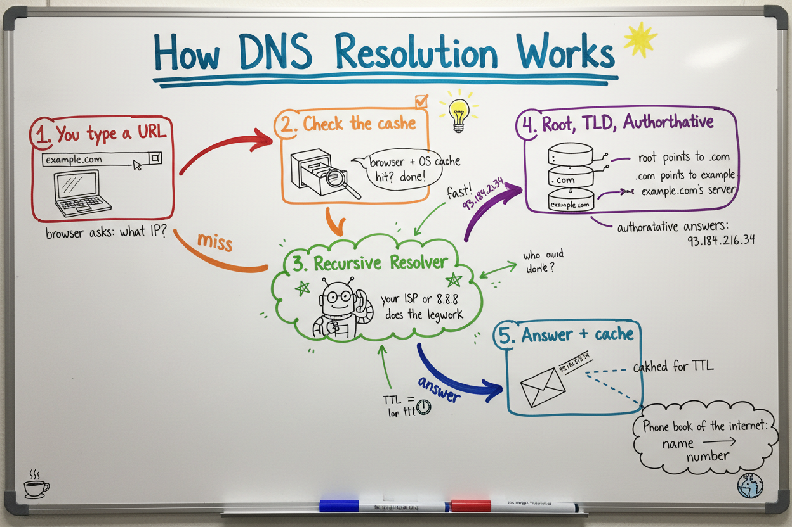
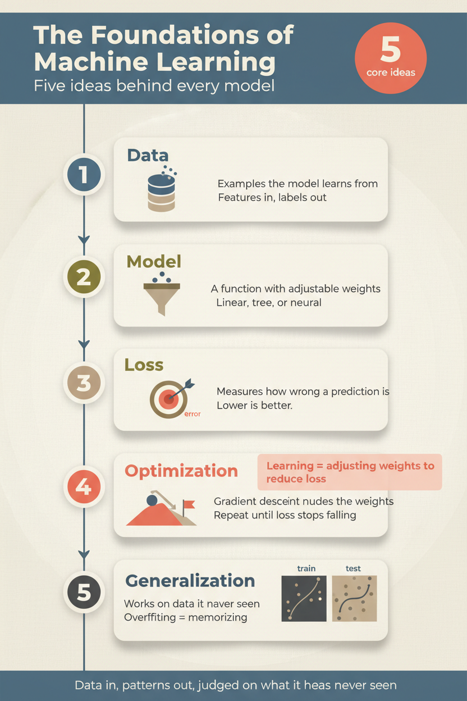
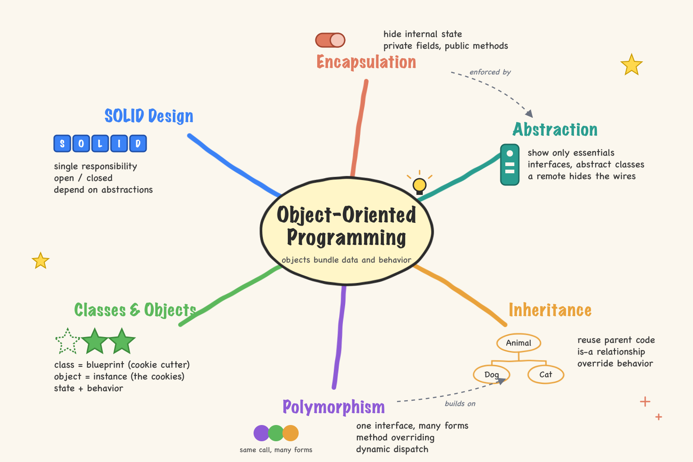
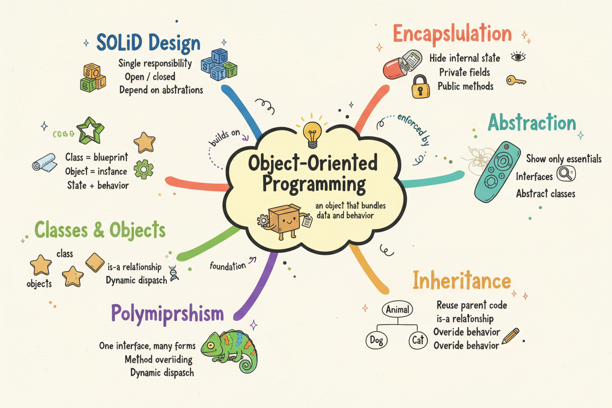
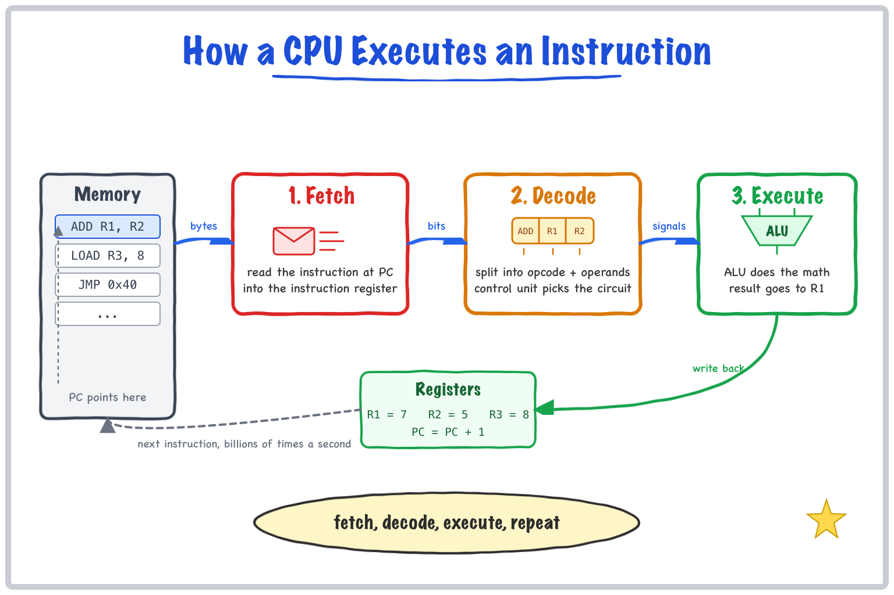

# poison

Turn any topic, document, codebase or Mermaid diagram into a visual explanation from inside
Claude Code. One slash command, one picture.

```
/poison --style infographic The foundations of machine learning
```

Seven styles: whiteboard, infographic, presentation, diagram, mindmap, mindmap-structured,
mockup. Three fidelity levels, three complexity levels, a multi-frame mode that builds an idea
up over 3-5 images, a video mode that animates those frames into a narrated MP4 with
Remotion, and Mermaid input so an existing flowchart or sequence diagram can be rendered in
any style.

The image model is not the product. The skill first analyzes the content (core idea,
sub-topics, relationships, a visual metaphor per concept, a layout strategy, a color per
section) and turns it into a spatial spec from a style template: every position, icon, label,
connector, color and typeface.

By default Claude then draws that spec itself as SVG and the script rasterizes it locally.
No image API, no per-image cost, no misspelled labels, and you keep an editable SVG. If you
want a painterly or photographic look instead, pass `--backend openrouter|openai|gemini` and
the same spec becomes a 400-800 word prompt for an image model.

## Examples

| Whiteboard: How DNS resolution works | Infographic: Foundations of machine learning |
|---|---|
|  |  |

| Mind map, default `claude` backend: Claude wrote the SVG, rendered locally, $0 |
|---|
|  |

| Same topic through `--backend openrouter` (about four cents, note the typos the image model adds) |
|---|
|  |

The whiteboard and infographic above were rendered through OpenRouter.

## Backends

| Backend | Env var | Default model | Cost per image | Notes |
|---|---|---|---|---|
| `claude` | none | the Claude session draws SVG, rasterized by rsvg-convert / Chromium / qlmanage | $0 | default; crisp text, editable SVG kept, clean-illustration look |
| `openrouter` | `OPENROUTER_API_KEY` | `google/gemini-2.5-flash-image` | ~$0.04 | honors aspect ratio; occasional typos in small text |
| `openai` | `OPENAI_API_KEY` | `gpt-image-1.5` | $0.19-0.29 | exact pixel sizes, best text rendering |
| `gemini` | `GEMINI_API_KEY` | `gemini-2.5-flash-image` | free tier | direct Google API |

`claude` needs a local SVG renderer: `brew install librsvg` gives `rsvg-convert`; a
Playwright or Google Chrome install, or macOS `qlmanage`, work as fallbacks. For the API
backends pick any model the backend accepts with `--model`, for example
`--backend openrouter --model google/gemini-3-pro-image`.

## Install

```bash
git clone https://github.com/AssiamahS/poison.git
cd poison
make install        # copies skill/ to ~/.claude/skills/poison and bin/poison to ~/.local/bin
make check          # verifies python3, files, and that an API key is visible
```

The default backend needs no key. For the image-model backends set one in your shell profile:

```bash
export OPENROUTER_API_KEY="sk-or-..."   # openrouter.ai/keys
```

The skill is available as `/poison` in every Claude Code session immediately. Runtime
dependencies are `python3` and, for the default backend, one SVG renderer
(`brew install librsvg`).

`/poison` is a slash command, so it only works inside a `claude` session. From a plain
shell use the wrapper, which runs the same skill through a one-shot session and drops the
PNG in the current directory:

```bash
poison --style mindmap The principles of object-oriented programming
```

## Usage

```
/poison [--style S] [--draw-level L] [--complexity C] [--mode M] [--from F] [--backend B] [--size WxH] [--output DIR] [--prefix NAME] <content>
```

```bash
/poison How DNS resolution works
/poison --style infographic The foundations of machine learning
/poison --draw-level sketch How Git branching works
/poison --style diagram --complexity detailed Kubernetes pod networking
/poison --style presentation --draw-level polished Microservices architecture
/poison --style mindmap The principles of object-oriented programming
/poison --style mindmap-structured Project management methodologies
/poison --style mockup --device desktop An admin dashboard with sidebar nav, stat cards and a data table
/poison --mode multi-frame The OAuth2 authorization code flow
/poison --mode video --narrate How a CPU executes an instruction
/poison --style whiteboard --from mermaid-file docs/architecture.mmd
/poison --output ./docs/images --prefix arch System architecture of the payments service
```

Because it runs inside Claude Code, it composes with file reading:

```
Read docs/api-spec.md, then /poison --style diagram the request lifecycle it describes
Review src/ and /poison --style diagram --complexity detailed the module dependency graph
Read notes/retro.md and /poison --draw-level sketch a whiteboard of the takeaways
```

### Options

| Option | Values | Default |
|---|---|---|
| `--style` | `whiteboard` `infographic` `presentation` `diagram` `mindmap` `mindmap-structured` `mockup` | `whiteboard` |
| `--draw-level` | `sketch` `normal` `polished` | `normal` |
| `--complexity` | `simple` (3-4) `moderate` (5-7) `detailed` (8-12 concepts) | `moderate` |
| `--device` | `mobile` `tablet` `desktop` (mockup only) | `mobile` |
| `--mode` | `single` `multi-frame` `video` | `single` |
| `--narrate` | speak each video frame with macOS `say` | off |
| `--voice` | any `say -v ?` voice | `Samantha` |
| `--from` | `mermaid` `mermaid-file PATH` | none |
| `--backend` | `claude` `openrouter` `openai` `gemini` | `claude` |
| `--model` | any model id for the backend | backend default |
| `--size` | `1024x1024` `1536x1024` `1024x1536` or a ratio like `16:9` | by style |
| `--output` | directory | `./` |
| `--prefix` | filename prefix | `poison` |

## Layout

```
skill/
  SKILL.md                 the pipeline Claude follows: parse flags, read Mermaid, analyze, build prompt, generate, report
  styles/<style>.md        one spec template per style, read on demand
  styles/svg-guide.md      how Claude draws the spec as SVG: fonts, rough filter, connectors, icons, text rules
  scripts/poison_gen.py    backend script: SVG or prompt file in, PNG out, prints a JSON line with path and cost
  scripts/poison_video.py  video mode: frames + captions (+ say narration) in, Remotion-rendered MP4 out
  video/                   the Remotion composition (title card, fade + settle per frame, caption pill, audio)
bin/poison                 shell wrapper: claude -p "/poison ..."
examples/                  rendered samples
Makefile                   install / uninstall / check / info
```

The generator can be used on its own:

```bash
python3 skill/scripts/poison_gen.py --svg-file drawing.svg --size 1536x1024 --out ./out --prefix demo
# {"path": "./out/demo-1.png", "svg": "drawing.svg", "backend": "claude", "model": "svg via rsvg-convert", "size": "1536x1024", "cost": 0}
python3 skill/scripts/poison_gen.py --backend openrouter --prompt-file prompt.txt --size 1536x1024 --out ./out --prefix demo
# {"path": "./out/demo-1.png", "backend": "openrouter", "model": "google/gemini-2.5-flash-image", "size": "1536x1024", "cost": 0.0389}
```

## Video mode

`--mode video` draws the multi-frame sequence, then hands the frames to a small
[Remotion](https://www.remotion.dev) composition in `skill/video/`: a one-second title card,
each frame fading in with a gentle settle, a caption pill sliding up, and with `--narrate` a
spoken line per frame generated offline by macOS `say`. Frame timing follows the narration.
Output is H.264 MP4 at 30 fps in the style's aspect ratio.

Example: [`examples/video-cpu/cpu.mp4`](examples/video-cpu/cpu.mp4), 31 seconds, three
cumulative whiteboard frames, narrated, rendered for $0.



Requirements: Node 20+ (Remotion installs into `skill/video/node_modules` on first use) and a
Chromium on disk (Google Chrome or a Playwright install; Remotion downloads one otherwise).
Narration is macOS only.

```bash
# the driver on its own
python3 skill/scripts/poison_video.py --title "How DNS works" --frames frames.json --out ./out --prefix dns --narrate
```

## Credits

Shape of the idea and the style list come from Eric Blue's
[visual-explainer-skill](https://github.com/ericblue/visual-explainer-skill) (MIT). Templates,
pipeline and generator here are written from scratch, with a free SVG-drawing backend as the
default and OpenRouter, OpenAI and Gemini as paid options.

MIT.
